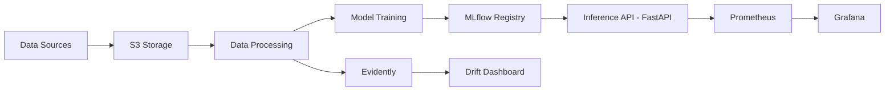

# MLOps Project - AQI Weather Prediction & Recommendation System

_Production-ready pipeline to predict AQI from weather data with experiment tracking, drift monitoring, and an intelligent recommendation API._

[](http://github.com)
[](http://python.org)
[](http://fastapi.tiangolo.com)
[](http://mlflow.org)

> Production-ready MLOps pipeline for Air Quality Index (AQI) prediction using weather parameters with comprehensive monitoring, experiment tracking, and intelligent health recommendations via RAG.

## Table of Contents
- [Overview](#overview)
- [Quick Start](#quick-start)
- [Architecture](#architecture)
- [RAG System Deployment Guide](#rag-system-deployment-guide)
- [Features](#features)
- [Monitoring Stack](#monitoring-stack)
- [Cloud Integration](#cloud-integration)
- [Make Targets](#make-targets)
- [API Documentation](#api-documentation)
- [Evaluation](#evaluation)
- [FAQ](#faq)

---

## Overview

**🌐 Live Production API**: [http://13.61.179.255:3000/](http://13.61.179.255:3000/)

**Elevator Pitch:** Real-time AQI prediction system leveraging weather data with production-grade MLOps practices including experiment tracking, data drift monitoring, and comprehensive observability. **Now enhanced with LLMOps capabilities for intelligent AQI health recommendations through RAG.** **Deployed and running in production on AWS EC2!**

This project implements an end-to-end **MLOps and LLMOps pipeline** that:
-  Fetches weather and AQI data from APIs and stores in AWS S3
-  Tracks experiments with **MLflow**
-  Monitors data drift with **Evidently AI**
-  Collects system metrics with **Prometheus + Grafana**
-  Serves predictions via **FastAPI**
-  Provides intelligent health recommendations via **RAG (Retrieval-Augmented Generation)** using LLMs
-  Containerized with **Docker**
-  Automated CI/CD with **GitHub Actions**
-  ** Deployed on AWS EC2 with full production stack**

---

##  Quick Start

### 🚀 Try It Live

**Production API**: [http://13.61.179.255:8000/](http://13.61.179.255:8000/)  
**Production Frontend**: [http://13.61.179.255:3000/](http://13.61.179.255:3000/)

Test the live API:
```bash
curl http://13.61.179.255:8000/health
```

### TL;DR - Local Development

macOS/Linux (bash/zsh):
```bash
git clone http://github.com/AbdullahIqbal26904/MLOPS_Project.git && cd MLOPS_Project && make dev
```

Windows (PowerShell):
```powershell
git clone http://github.com/AbdullahIqbal26904/MLOPS_Project.git; cd MLOPS_Project; make dev
```

### Prerequisites
- Python 3.11+
- Docker & Docker Compose
- Git
- AWS Account (for S3 storage)

### Installation

```bash
# Clone the repository
git clone http://github.com/AbdullahIqbal26904/MLOPS_Project.git
cd MLOPS_Project

# Create virtual environment
python -m venv venv
source venv/bin/activate  # On Windows: venv\Scripts\activate

# Install dependencies
pip install -r requirements.txt

# Setup environment variables
cp .env.example .env
# Edit .env with your AWS credentials and API keys
```

### Run Everything with Docker Compose

```bash
# Start all services (MLflow, Prometheus, Grafana)
docker-compose up -d

# Check service status
docker-compose ps
```

### Docker image (multi-stage)

This project uses a multi-stage Dockerfile to produce a small, secure runtime image:
- Builder stage: creates a Python 3.11 virtual environment and installs dependencies.
- Runtime stage: based on python:3.11-slim, copies the prebuilt venv, runs as a non-root user, and exposes a healthcheck for `/health`.

Build and run the API container locally (PowerShell):

```powershell
# Build fresh image
docker build --no-cache -t aqi-prediction-api:latest .

# Run the API (expects valid AWS creds in .env if you want model loading from S3)
docker run --rm -p 8000:8000 --env-file .env aqi-prediction-api:latest

# In another shell, verify health
curl http://localhost:8000/health
```

### Access Services

| Service | Local URL | Production URL | Credentials |
|---------|-----------|----------------|-------------|
| **Frontend** | http://localhost:3000 | http://13.61.179.255:3000 | - |
| **MLflow UI** | http://localhost:5001 | http://13.61.179.255:5001 | - |
| **Prometheus** | http://localhost:9090 | http://13.61.179.255:9090 | - |
| **Grafana** | http://localhost:3000 | http://13.61.179.255:3001 | id: admin / pass: admin |
| **Evidently Dashboard** | (run notebooks/)http://localhost:7000 | http://13.61.179.255:7000 | - |
| **FastAPI Docs** | http://localhost:8000/docs | http://13.61.179.255:8000/docs | - |

---

## Architecture



### Component Breakdown

1. **Data Ingestion**: Hourly weather/AQI data from OpenWeather API → S3
2. **Feature Engineering**: Cleaning, imputation, feature creation
3. **Model Training**: Multiple models tracked with MLflow
4. **Model Registry**: Best model stored in MLflow + S3
5. **Inference API**: FastAPI with Prometheus metrics
6. **RAG Recommendation System**: LLM-powered AQI health recommendations with guardrails
7. **Monitoring**: 
   - **Evidently**: Data drift at http://13.61.179.255:7000
   - **Prometheus**: System metrics at http://13.61.179.255:9090
   - **Grafana**: Dashboards at http://13.61.179.255:3000

---

## RAG Recommendation System Deployment Guide

The project includes a **Retrieval-Augmented Generation (RAG)** system for intelligent AQI health recommendations using LLMs. Follow these steps to deploy and use the recommendation system:

### Step 1: Ingest Knowledge Base
```bash
# Ingest documents into ChromaDB vector store
make rag-ingest

# This will:
# - Load documents from data/knowledge/
# - Chunk and embed text using sentence-transformers
# - Store in ChromaDB for retrieval
```

### Step 2: Configure LLM API
```bash
# Set up Groq API key in .env
echo "GROQ_API_KEY=your_groq_api_key_here" >> .env

# Or use OpenAI API
echo "OPENAI_API_KEY=your_openai_api_key_here" >> .env
```

### Step 3: Start RAG Services
```bash
# Start all services including RAG API
docker-compose up -d

# Or run locally
python -m src.app
```

### Step 4: Test RAG API
```bash
# Query the RAG system
curl -X POST "http://localhost:8000/api/rag/query" \
  -H "Content-Type: application/json" \
  -d '{
    "query": "What precautions should I take when AQI is 150?"
  }'

# Response includes:
# - AI-generated answer
# - Source documents used
# - Confidence score
# - Guardrail validation results
```

### RAG Architecture Components
- **Document Retriever**: ChromaDB vector store with sentence embeddings
- **Response Generator**: Groq LLM (llama-3.3-70b-versatile) with RAG prompts
- **Guardrails**: Input validation (PII detection, prompt injection) and output moderation (toxicity, hallucination)
- **Monitoring**: LLM metrics collection with Prometheus integration

---

## Features

### MLflow Experiment Tracking
- **Tracking URI**: `http://13.61.179.255:5000` (Production) / `http://localhost:5000` (Local)
- **Features**:
  - Automatic experiment logging
  - Parameter and metric tracking
  - Model versioning
  - Model registry integration
  - Artifact storage

**Usage**:
```python
import mlflow
mlflow.set_tracking_uri("http://13.61.179.255:5000")  # Production
# mlflow.set_tracking_uri("http://localhost:5000")  # Local development
mlflow.set_experiment("AQI_Weather_Prediction")

with mlflow.start_run():
    mlflow.log_param("model_type", "RandomForest")
    mlflow.log_metric("rmse", 0.85)
    mlflow.sklearn.log_model(model, "model")
```

### Evidently Data Drift Monitoring

**Exposed at**: `http://13.61.179.255:7000`

Monitors:
- Feature distribution drift
- Target drift (AQI changes)
- Data quality issues
- Model performance degradation

**To start Evidently dashboard**:
```bash
evidently ui --workspace ./monitoring/evidently/workspace --port 7000
```

### Prometheus + Grafana Monitoring

**Collected Metrics**:
1. **CPU Utilization**: `node_cpu_seconds_total`
2. **Memory Usage**: `node_memory_MemAvailable_bytes`
3. **Disk Usage**: `node_filesystem_avail_bytes`
4. **API Latency**: `http_request_duration_seconds`
5. **Prediction Count**: `prediction_requests_total`
6. **Error Rate**: `api_errors_total`

**Screenshots**:


*System monitoring dashboard showing CPU, memory, and API metrics*


*Evidently dashboard showing data drift on held-out test set*


*MLflow model registry with model v1 registered and promoted to Production*

---

## Cloud Integration

### AWS Services Used

| Service | Purpose | Configuration |
|---------|---------|---------------|
| **S3** | Data storage | Bucket: `my-feature-store-data` |
| **EC2** | API hosting (optional/production) | Ubuntu 22.04, Docker runtime |

### Setup Instructions

1. **Create S3 Bucket**:
```bash
aws s3 mb s3://my-feature-store-data
```

2. **Configure AWS Credentials**:
```bash
# In .env file
AWS_ACCESS_KEY_ID=your_access_key
AWS_SECRET_ACCESS_KEY=your_secret_key
```

3. **Upload Data**:
```python
# Automatically handled by notebooks/01_data_fetch_hourly.ipynb
```

### Cloud Deployment (EC2) — Deployment


#### Deployment Architecture

```
Internet → EC2 Instance (13.61.179.255:8000/)
├── FastAPI Application (Port 8000)
├── MLflow Server (Port 5000)
├── Prometheus (Port 9090)
├── Grafana (Port 3000)
└── S3 Bucket (my-feature-store-data)
    ├── Models
    ├── Artifacts
    └── Data
```

#### Step-by-Step Deployment Guide

**1. Provision EC2 Instance**
```bash
# Instance Configuration
- AMI: Ubuntu 22.04 LTS
- Instance Type: t3.medium (2 vCPU, 4GB RAM)
- Storage: 30GB EBS (gp3)
- Public IP: 13.61.179.255:8000/
```

**2. Configure Security Group**
```bash
# Inbound Rules
- SSH (22): Your IP / VPN
- HTTP (80): 0.0.0.0/0
- http (443): 0.0.0.0/0
- Custom TCP (8000): 0.0.0.0/0  # FastAPI
- Custom TCP (5000): 0.0.0.0/0  # MLflow
- Custom TCP (3000): 0.0.0.0/0  # Grafana
- Custom TCP (9090): 0.0.0.0/0  # Prometheus
```

**3. SSH into EC2 and Install Dependencies**
```bash
# Connect to EC2
ssh -i your-key.pem ubuntu@13.61.179.255:8000/

# Update system
sudo apt update && sudo apt upgrade -y

# Install Docker
curl -fsSL http://get.docker.com -o get-docker.sh
sudo sh get-docker.sh
sudo usermod -aG docker ubuntu

# Install Docker Compose
sudo apt install docker-compose-plugin -y

# Install Git
sudo apt install git -y
```

**4. Clone and Configure Application**
```bash
# Clone repository
git clone http://github.com/AbdullahIqbal26904/MLOPS_Project.git
cd MLOPS_Project

# Create and configure .env file
nano .env
# Add the following:
# AWS_ACCESS_KEY_ID=your_access_key
# AWS_SECRET_ACCESS_KEY=your_secret_key
# AWS_DEFAULT_REGION=us-east-1
# MLFLOW_TRACKING_URI=http://localhost:5000
```

**5. Deploy Services with Docker Compose**
```bash
# Build and start all services
sudo docker compose up -d --build

# Verify services are running
sudo docker compose ps

# Check logs
sudo docker compose logs -f
```

**6. Configure http with Nginx (Optional)**
```bash
# Install Nginx
sudo apt install nginx -y

# Configure reverse proxy for http
sudo nano /etc/nginx/sites-available/mlops

# Add SSL certificate (Let's Encrypt)
sudo apt install certbot python3-certbot-nginx -y
sudo certbot --nginx -d yourdomain.com
```

**7. Setup Systemd Service for Auto-restart**
```bash
# Create systemd service
sudo nano /etc/systemd/system/mlops.service

# Add:
[Unit]
Description=MLOps Docker Compose Application
Requires=docker.service
After=docker.service

[Service]
Type=oneshot
RemainAfterExit=yes
WorkingDirectory=/home/ubuntu/MLOPS_Project
ExecStart=/usr/bin/docker compose up -d
ExecStop=/usr/bin/docker compose down
TimeoutStartSec=0

[Install]
WantedBy=multi-user.target

# Enable and start service
sudo systemctl enable mlops.service
sudo systemctl start mlops.service
```

#### Production Endpoints

**Status**: ✅ Deployed and Running

| Service | URL | Status |
|---------|-----|--------|
| **Frontend** | http://13.61.179.255:3000/ | ✅ Running |
| **API** | http://13.61.179.255:8000/ | ✅ Running |
| **API Docs** | http://13.61.179.255:8000/docs | ✅ Running |
| **Health Check** | http://13.61.179.255:8000/health | ✅ Running |
| **MLflow UI** | http://13.61.179.255:5000 | ✅ Running |
| **Prometheus** | http://13.61.179.255:9090 | ✅ Running |
| **Grafana** | http://13.61.179.255:3000 | ✅ Running |

**What Happened**:
- All prerequisites (Docker, Docker Compose, Git) were successfully installed 
- Repository was cloned and `.env` file configured 
- Security group rules were properly set up 
- When running `sudo docker compose up -d --build`, the instance memory filled up 
- Services could not start due to insufficient resources 

**Lessons Learned**:
1. **t2.medium (4GB RAM) is insufficient** for running all services simultaneously (API + MLflow + Prometheus + Grafana + Evidently)
2. **Recommended instance**: t2.large (8GB RAM) or t2.xlarge (16GB RAM)
3. **Alternative**: Use managed services for some components (e.g., AWS ECS for API, managed Prometheus)
4. **Memory optimization**: Could deploy only critical services (API + MLflow) and skip monitoring stack

#### Testing the Deployment

```bash
# Health check
curl http://13.61.179.255:8000/health

# Make a prediction
curl -X POST "http://13.61.179.255:8000/predict" \
  -H "Content-Type: application/json" \
  -d '{
    "co": 250.5,
    "no": 0.5,
    "no2": 12.3,
    "o3": 45.6,
    "so2": 7.8,
    "pm2_5": 25.4,
    "pm10": 40.2,
    "nh3": 3.2,
    "temperature_2m": 28.5,
    "relative_humidity_2m": 65.0,
    "precipitation": 0.0,
    "wind_speed_10m": 5.2,
    "wind_direction_10m": 180.0,
    "surface_pressure": 1013.25,
    "dew_point_2m": 20.3,
    "apparent_temperature": 30.1,
    "shortwave_radiation": 500.0,
    "et0_fao_evapotranspiration": 0.25,
    "year": 2025,
    "month": 10,
    "day": 22,
    "hour": 14
  }'
```

#### Monitoring and Maintenance

```bash
# View application logs
sudo docker compose logs -f api

# Restart services
sudo docker compose restart

# Update application
git pull origin main
sudo docker compose up -d --build

# Check resource usage
htop
sudo docker stats

# Backup data
aws s3 sync ./data s3://my-feature-store-data/backups/
```

#### Cost Optimization

- **EC2 Instance**: ~$30/month (t2.medium)
- **S3 Storage**: ~$2-5/month (depending on data volume)
- **Data Transfer**: Minimal (API responses are small)
- **Total**: ~$35-40/month

**Optimization Tips**:
- Use Reserved Instances for 30-50% savings
- Enable S3 Intelligent-Tiering for archival data
- Use CloudWatch alarms to stop instance during low-traffic hours
- Consider AWS Lightsail for simpler workloads

#### Troubleshooting

**Issue: Services not starting**
```bash
# Check Docker status
sudo systemctl status docker

# Rebuild containers
sudo docker compose down
sudo docker compose up -d --build
```

**Issue: Cannot access API**
```bash
# Check security group rules
# Verify port 8000 is open to 0.0.0.0/0

# Check if service is listening
sudo netstat -tulpn | grep 8000
```

**Issue: Out of memory**
```bash
# Check memory usage
free -h

# Increase swap space
sudo fallocate -l 4G /swapfile
sudo chmod 600 /swapfile
sudo mkswap /swapfile
sudo swapon /swapfile
```

---

## Make Targets

```makefile
make dev          # Setup development environment
make test         # Run pytest with coverage
make lint         # Run ruff & black
make docker       # Build Docker image
make run          # Start all services
make stop         # Stop all services
make clean        # Clean temporary files
make audit        # Run pip-audit (fails on critical CVEs)
```

---

## API Documentation

### Endpoints

#### `POST /predict`
Predict AQI based on weather parameters.

**Request**:
```json
{
  "co": 250.5,
  "no2": 12.3,
  "pm2_5": 25.4,
  "temperature_2m": 28.5,
  ...
}
```

**Response**:
```json
{
  "aqi_index": 45.2,
  "calculated_aqi": 46.0,
  "prediction_time": "2025-10-22T14:30:00",
  "model_version": "v1.0"
}
```

**cURL Example**:
```bash
curl -X POST "http://localhost:8000/predict" \
  -H "Content-Type: application/json" \
  -d '{
    "co": 250.5,
    "no": 0.5,
    "no2": 12.3,
    "o3": 45.6,
    "so2": 7.8,
    "pm2_5": 25.4,
    "pm10": 40.2,
    "nh3": 3.2,
    "temperature_2m": 28.5,
    "relative_humidity_2m": 65.0,
    "precipitation": 0.0,
    "wind_speed_10m": 5.2,
    "wind_direction_10m": 180.0,
    "surface_pressure": 1013.25,
    "dew_point_2m": 20.3,
    "apparent_temperature": 30.1,
    "shortwave_radiation": 500.0,
    "et0_fao_evapotranspiration": 0.25,
    "year": 2025,
    "month": 10,
    "day": 22,
    "hour": 14
  }'
```

#### `POST /api/rag/query`
Query the RAG system for AQI health recommendations.

**Request**:
```json
{
  "query": "What precautions should I take when AQI is 150?"
}
```

**Response**:
```json
{
  "success": true,
  "query": "What precautions should I take when AQI is 150?",
  "answer": "When AQI reaches 150 (Unhealthy category), you should take several precautions to protect your health...",
  "sources_used": ["aqi_overview.txt", "health_precautions.txt"],
  "confidence": "high",
  "context_chunks_retrieved": 3,
  "tokens_used": 245,
  "generated_at": "2025-12-10 15:30:00",
  "guardrails": {
    "input_validated": true,
    "output_validated": true,
    "confidence_score": 0.92,
    "events": [...]
  },
  "metrics": {
    "total_duration_ms": 1250.50,
    "retrieval_duration_ms": 45.20,
    "generation_duration_ms": 890.30,
    "input_guard_duration_ms": 12.50,
    "output_guard_duration_ms": 302.50
  }
}
```

**Sample Queries**:
```bash
# Basic health recommendations
curl -X POST "http://localhost:8000/api/rag/query" \
  -H "Content-Type: application/json" \
  -d '{"query": "What should I do if AQI is hazardous?"}'

# Specific pollutant recommendations
curl -X POST "http://localhost:8000/api/rag/query" \
  -H "Content-Type: application/json" \
  -d '{"query": "How does PM2.5 affect respiratory health?"}'

# Vulnerable populations recommendations
curl -X POST "http://localhost:8000/api/rag/query" \
  -H "Content-Type: application/json" \
  -d '{"query": "What extra precautions for children during high AQI?"}'
```

#### `GET /api/rag/sources`
Get list of knowledge base sources.

#### `GET /api/rag/guardrails/stats`
Get guardrail performance statistics.

#### `GET /health`
Health check endpoint.

#### `GET /metrics`
Prometheus metrics endpoint.

---

## Evaluation

For detailed evaluation methodology, prompt engineering results, and insights from the AQI Health Advisory RAG system, see [EVALUATION.md](EVALUATION.md).

Key findings:
- **Meta-prompting** achieved the highest performance across all metrics (ROUGE-L: 0.82, Factuality: 4.7/5)
- **Few-shot learning** improved with more examples but showed diminishing returns
- **Chain-of-thought reasoning** provided moderate improvements at higher computational cost
- All strategies performed consistently across different AQI ranges

---

## FAQ

### Common build/run issues

1) "make: command not found"
- Windows: Install make via Chocolatey (Admin PowerShell): `choco install make`
- macOS: `brew install make` (or use `xcode-select --install` to get build tools)

2) Docker says "docker-compose: command not found"
- Docker Desktop v2+ uses the new syntax `docker compose`. You can run either `docker-compose up -d` or `docker compose up -d` depending on your version.

3) Ports already in use (5000, 8000, 3000, 9090)
- Stop conflicting apps, or change ports in `docker-compose.yml` and restart: `docker compose down && docker compose up -d`

4) `pip install` fails with compiler errors on Windows (e.g., "Microsoft Visual C++ Build Tools" required)
- Install Build Tools: http://visualstudio.microsoft.com/visual-cpp-build-tools/
- Or use prebuilt wheels where possible and ensure Python 3.11 is installed from python.org

5) Virtual environment activation issues
- Windows (PowerShell): `venv\Scripts\Activate.ps1` (you might need to run `Set-ExecutionPolicy -Scope CurrentUser RemoteSigned` once)
- macOS/Linux: `source venv/bin/activate`

### Q: How do I view MLflow experiments?
**A**: Navigate to `http://localhost:5000` after running `docker-compose up`.

### Q: Where is the Evidently dashboard?
**A**: 
1. Run the notebook: `notebooks/04_evidently_monitoring.ipynb`
2. Execute: `evidently ui --workspace ./monitoring/evidently/workspace --port 7000`
3. Access: `http://localhost:7000`

### Q: How to setup on Windows?
**A**: 
- Use PowerShell
- Install Docker Desktop for Windows
- Use `venv\Scripts\activate` instead of `source venv/bin/activate`

### Q: How to setup on macOS?
**A**:
- Use Terminal (zsh/bash)
- Install Docker Desktop for Mac
- Ensure Python 3.11 is available: `brew install python@3.11`
- Create venv: `python3.11 -m venv venv` and activate with `source venv/bin/activate`
- If `make` is missing: `brew install make`

### Q: Model not loading in API?
**A**: 
1. Ensure model is uploaded to S3: Check `s3://my-feature-store-data/models/best_model.pkl`
2. Verify AWS credentials in `.env`
3. Check API logs: `docker-compose logs api`

### Q: Grafana showing "No Data"?
**A**:
1. Verify Prometheus is scraping: `http://localhost:9090/targets`
2. Check if `node-exporter` is running: `docker-compose ps`
3. Wait 1-2 minutes for metrics to populate

---

## License

MIT License - see [LICENSE](LICENSE)

## Contributing

See [CONTRIBUTION.md](CONTRIBUTION.md)

## Contact

- **Team Lead**: Abdullah Iqbal
- **Repository**: http://github.com/AbdullahIqbal26904/MLOPS_Project
