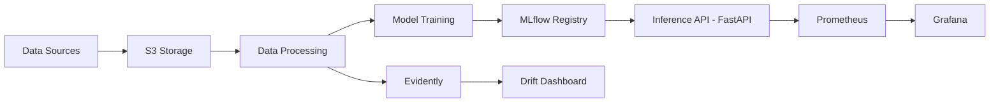
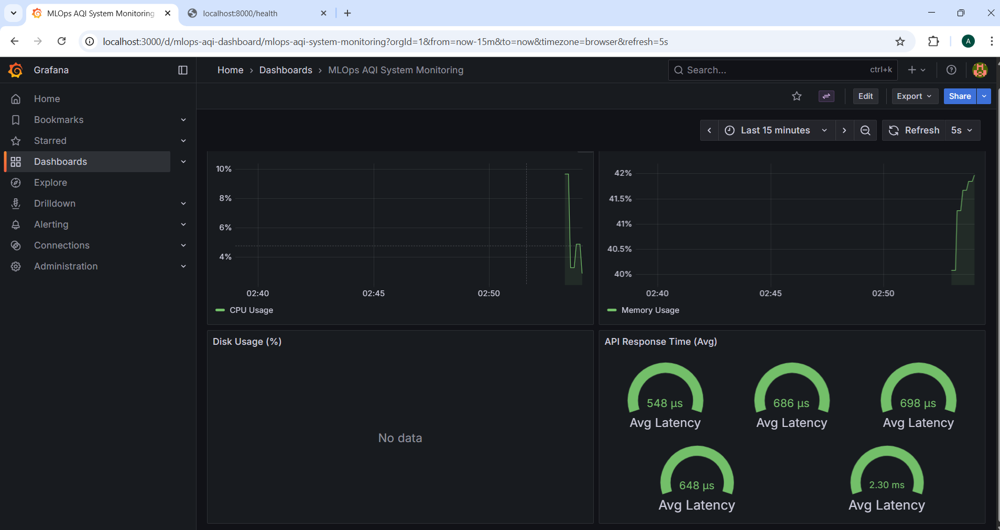
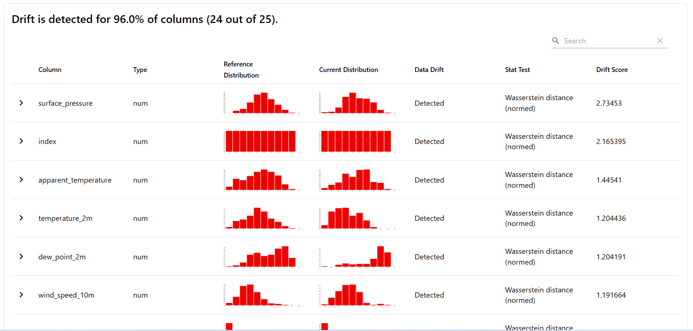
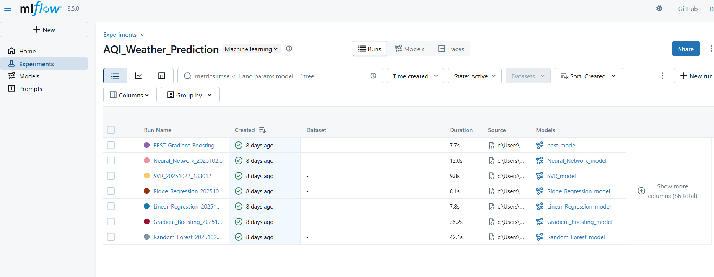

# MLOps Project - AQI Weather Prediction System

_Production-ready pipeline to predict AQI from weather data with experiment tracking, drift monitoring, and an inference API._

[](https://github.com)
[](https://python.org)
[](https://fastapi.tiangolo.com)
[](https://mlflow.org)

> Production-ready MLOps pipeline for Air Quality Index (AQI) prediction using weather parameters with comprehensive monitoring and experiment tracking.

## Table of Contents
- [Overview](#overview)
- [Project Overview](#project-overview) 
- [LLMOps Objectives](#llmops-Objectives)
- [Quick Start](#quick-start)
- [Architecture](#architecture)
- [Features](#features)
- [Monitoring Stack](#monitoring-stack)
- [Cloud Integration](#cloud-integration)
- [Step-by-Step RAG Deployment Guide](#step-by-step-rag-deployment-guide)
- [API Usage Examples with Sample Queries](#api-usage-examples-with-sample-queries)
- [Make Targets](#make-targets)
- [API Documentation](#api-documentation)
- [FAQ](#faq)

---

## Overview

**Elevator Pitch:** Real-time AQI prediction system leveraging weather data with production-grade MLOps practices including experiment tracking, data drift monitoring, and comprehensive observability.

This project implements an end-to-end machine learning pipeline that:
-  Fetches weather and AQI data from APIs and stores in AWS S3
-  Tracks experiments with **MLflow**
-  Monitors data drift with **Evidently AI**
-  Collects system metrics with **Prometheus + Grafana**
-  Serves predictions via **FastAPI**
-  Containerized with **Docker**
-  Automated CI/CD with **GitHub Actions**

---
## Project Overview

This project is a **production-ready MLOps pipeline** designed to predict the **Air Quality Index (AQI)** using weather data. The system integrates machine learning with production-grade practices to ensure robust model deployment, continuous monitoring, and easy maintenance. Key components include:

* **Data Ingestion & Processing**: Collecting and processing weather and AQI data.
* **Model Training & Tracking**: Using **MLflow** for model tracking and versioning.
* **Drift Monitoring**: Detecting data and model drift with **Evidently AI**.
* **Model Serving**: Exposing predictions via a **FastAPI**.
* **Cloud Deployment & CI/CD**: Deployed on **AWS EC2** with automated CI/CD pipelines.
* **System Monitoring**: Monitoring system health with **Prometheus** and **Grafana**.

## LLMOps Objectives

The primary objectives of this project are:

1. **Model Deployment**: Automate the deployment and updates of machine learning models with CI/CD.
2. **Experiment Tracking**: Use **MLflow** for tracking model versions and ensuring reproducibility.
3. **Data Drift Monitoring**: Implement **Evidently AI** for continuous monitoring of data and model drift.
4. **System Monitoring**: Collect system metrics with **Prometheus** and visualize them with **Grafana**.
5. **Scalable Model Management**: Use **Docker** for containerized model serving, making the system scalable and easy to maintain.
6. **Automated Retraining**: Set up pipelines for model retraining to ensure up-to-date predictions.


##  Quick Start

### TL;DR

macOS/Linux (bash/zsh):
```bash
git clone https://github.com/AbdullahIqbal26904/MLOPS_Project.git && cd MLOPS_Project && make dev
```

Windows (PowerShell):
```powershell
git clone https://github.com/AbdullahIqbal26904/MLOPS_Project.git; cd MLOPS_Project; make dev
```

### Prerequisites
- Python 3.11+
- Docker & Docker Compose
- Git
- AWS Account (for S3 storage)

### Installation

```bash
# Clone the repository
git clone https://github.com/AbdullahIqbal26904/MLOPS_Project.git
cd MLOPS_Project

# Create virtual environment
python -m venv venv
source venv/bin/activate  # On Windows: venv\Scripts\activate

# Install dependencies
pip install -r requirements.txt

# Setup environment variables
cp .env.example .env
# Edit .env with your AWS credentials and API keys
```

### Run Everything with Docker Compose

```bash
# Start all services (MLflow, Prometheus, Grafana)
docker-compose up -d

# Check service status
docker-compose ps
```

### Docker image (multi-stage)

This project uses a multi-stage Dockerfile to produce a small, secure runtime image:
- Builder stage: creates a Python 3.11 virtual environment and installs dependencies.
- Runtime stage: based on python:3.11-slim, copies the prebuilt venv, runs as a non-root user, and exposes a healthcheck for `/health`.

Build and run the API container locally (PowerShell):

```powershell
# Build fresh image
docker build --no-cache -t aqi-prediction-api:latest .

# Run the API (expects valid AWS creds in .env if you want model loading from S3)
docker run --rm -p 8000:8000 --env-file .env aqi-prediction-api:latest

# In another shell, verify health
curl http://localhost:8000/health
```

### Access Services

| Service | URL | Credentials |
|---------|-----|-------------|
| **MLflow UI** | http://localhost:5000 | - |
| **Prometheus** | http://localhost:9090 | - |
| **Grafana** | http://localhost:3000 | admin / admin |
| **Evidently Dashboard** | http://localhost:7000 | - |
| **FastAPI Docs** | http://localhost:8000/docs | - |

---

## Architecture



### Component Breakdown

1. **Data Ingestion**: Hourly weather/AQI data from OpenWeather API → S3
2. **Feature Engineering**: Cleaning, imputation, feature creation
3. **Model Training**: Multiple models tracked with MLflow
4. **Model Registry**: Best model stored in MLflow + S3
5. **Inference API**: FastAPI with Prometheus metrics
6. **Monitoring**: 
   - **Evidently**: Data drift at localhost:7000
   - **Prometheus**: System metrics at localhost:9090
   - **Grafana**: Dashboards at localhost:3000

---

## Features

### MLflow Experiment Tracking
- **Tracking URI**: `http://localhost:5000`
- **Features**:
  - Automatic experiment logging
  - Parameter and metric tracking
  - Model versioning
  - Model registry integration
  - Artifact storage

**Usage**:
```python
import mlflow
mlflow.set_tracking_uri("http://localhost:5000")
mlflow.set_experiment("AQI_Weather_Prediction")

with mlflow.start_run():
    mlflow.log_param("model_type", "RandomForest")
    mlflow.log_metric("rmse", 0.85)
    mlflow.sklearn.log_model(model, "model")
```

### Evidently Data Drift Monitoring

**Exposed at**: `http://localhost:7000`

Monitors:
- Feature distribution drift
- Target drift (AQI changes)
- Data quality issues
- Model performance degradation

**To start Evidently dashboard**:
```bash
evidently ui --workspace ./monitoring/evidently/workspace --port 7000
```

### Prometheus + Grafana Monitoring

**Collected Metrics**:
1. **CPU Utilization**: `node_cpu_seconds_total`
2. **Memory Usage**: `node_memory_MemAvailable_bytes`
3. **Disk Usage**: `node_filesystem_avail_bytes`
4. **API Latency**: `http_request_duration_seconds`
5. **Prediction Count**: `prediction_requests_total`
6. **Error Rate**: `api_errors_total`

**Screenshots**:


*System monitoring dashboard showing CPU, memory, and API metrics*


*Evidently dashboard showing data drift on held-out test set*


*MLflow model registry with model v1 registered and promoted to Production*

---

## Cloud Integration

### AWS Services Used

| Service | Purpose | Configuration |
|---------|---------|---------------|
| **S3** | Data storage | Bucket: `my-feature-store-data` |
| **EC2** | API hosting (optional/production) | Ubuntu 22.04, Docker runtime |

### Setup Instructions

1. **Create S3 Bucket**:
```bash
aws s3 mb s3://my-feature-store-data
```

2. **Configure AWS Credentials**:
```bash
# In .env file
AWS_ACCESS_KEY_ID=your_access_key
AWS_SECRET_ACCESS_KEY=your_secret_key
```

3. **Upload Data**:
```python
# Automatically handled by notebooks/01_data_fetch_hourly.ipynb
```

### Cloud Deployment (EC2) — How to Reproduce

This project can be deployed on an EC2 instance and connect to S3 for model/artifact storage.

1) Provision EC2:
- Choose Ubuntu 22.04 (t2.medium or above recommended)
- Open ports: 22 (SSH), 8000 (API), 3000 (Grafana), 5000 (MLflow), 9090 (Prometheus)

2) Install Docker & Docker Compose:
- Install Docker Engine and enable `docker compose` plugin.

3) Configure environment:
- Set the following environment variables (or use `.env`):
  - `AWS_ACCESS_KEY_ID`
  - `AWS_SECRET_ACCESS_KEY`

4) Run services:
- `docker compose up -d`
- Verify MLflow at `http://<EC2_PUBLIC_IP>:5000`
- Verify API at `http://<EC2_PUBLIC_IP>:8000/health`

5) Observability:
- Prometheus: `http://<EC2_PUBLIC_IP>:9090`
- Grafana: `http://<EC2_PUBLIC_IP>:3000` (admin/admin)

6) Model Registry (MLflow):
- Tracking URI: `http://<EC2_PUBLIC_IP>:5000`
- Register best model as `aqi-model` and promote to `Production` (v1).
- Link: Add a screenshot of the registered model (see below).

---
## Step-by-Step RAG Deployment Guide

This section outlines how to deploy the **Random Access Generator (RAG)** system and services for AQI prediction using the steps outlined below. It assumes you are using Docker and Docker Compose for containerization and AWS EC2 for cloud deployment.

### Prerequisites
- **AWS EC2 instance**: A running instance (Ubuntu 22.04 LTS recommended).
- **Docker**: Ensure Docker and Docker Compose are installed on your EC2 instance.
- **GitHub repository access**: Make sure you have cloned the repository.

### Deployment Steps

1. **Clone the Repository**:
    Clone the repository onto your EC2 instance:
    ```bash
    git clone https://github.com/AbdullahIqbal26904/MLOPS_Project.git
    cd MLOPS_Project
    ```

2. **Set up Environment Variables**:
    Copy the example `.env` file and configure it with your AWS credentials:
    ```bash
    cp .env.example .env
    ```
    Edit the `.env` file with your AWS credentials:
    ```bash
    AWS_ACCESS_KEY_ID=your_access_key
    AWS_SECRET_ACCESS_KEY=your_secret_key
    MLFLOW_TRACKING_URI=http://localhost:5000  # Update this with your MLflow URI if using a remote instance
    ```

3. **Build and Run the Docker Containers**:
    Build and start all required services with Docker Compose:
    ```bash
    docker-compose up -d --build
    ```
    This command will build the images and start the services in the background. To check the status of the services, use:
    ```bash
    docker-compose ps
    ```

4. **Expose Necessary Ports**:
    Ensure that the required ports are open for the services:
    - **FastAPI API**: Port 8000
    - **MLflow UI**: Port 5000
    - **Prometheus**: Port 9090
    - **Grafana**: Port 3000
    - **Evidently**: Port 7000

5. **Verify the Deployment**:
    Once the containers are running, you can verify that the services are accessible:
    - **API Health Check**: `curl http://localhost:8000/health`
    - **Access MLflow**: Navigate to `http://localhost:5000` to view experiments and models.
    - **Grafana Dashboard**: Navigate to `http://localhost:3000` to check system metrics.
    - **Evidently Dashboard**: Navigate to `http://localhost:7000` to view data drift visualizations.

6. **Test the API**:
    Once everything is running, test the **predict endpoint**:
    ```bash
    curl -X POST "http://localhost:8000/predict" \
      -H "Content-Type: application/json" \
      -d '{
        "co": 250.5,
        "no2": 12.3,
        "pm2_5": 25.4,
        "temperature_2m": 28.5,
        "relative_humidity_2m": 65.0
      }'
    ```

7. **Optional — Configure Nginx and SSL**:
    For added security, set up **Nginx** as a reverse proxy and enable **SSL** using **Let's Encrypt**:
    - Install Nginx:
      ```bash
      sudo apt install nginx -y
      ```
    - Configure Nginx to proxy requests to your FastAPI application.
    - Use Certbot to set up SSL:
      ```bash
      sudo apt install certbot python3-certbot-nginx -y
      sudo certbot --nginx -d yourdomain.com
      ```

### Troubleshooting
If you encounter any issues during deployment:
- **Out of memory**: Ensure your EC2 instance has enough memory. Consider using `t2.large` or higher for production.
- **Service not starting**: Check logs with `docker-compose logs -f` and verify configuration.
- **API not accessible**: Ensure the correct ports are open in the **AWS security group** and Docker is running.
---
## API Usage Examples with Sample Queries

This section provides examples of how to use the deployed API for AQI prediction and health checks.

### 1. **API Health Check**

To check if the API is running and healthy, send a **GET** request to the `/health` endpoint:

```bash
curl http://localhost:8000/health
```

#### Response:
```json
{
  "status": "healthy"
}
```

### 2. **AQI Prediction**
```bash
curl -X POST "http://localhost:8000/predict" \
  -H "Content-Type: application/json" \
  -d '{
    "co": 250.5,
    "no2": 12.3,
    "pm2_5": 25.4,
    "temperature_2m": 28.5,
    "relative_humidity_2m": 65.0,
    "wind_speed_10m": 5.2,
    "wind_direction_10m": 180.0,
    "precipitation": 0.0
  }'
```
  
#### Response:
```json
{
  "aqi_index": 45.2,
  "calculated_aqi": 46.0,
  "prediction_time": "2025-10-22T14:30:00",
  "model_version": "v1.0"
}
```
### 3. **Model Version Information**
```bash
curl http://localhost:8000/model_version
```

#### Response:
```json
{
  "model_version": "v1.0"
}
```
### 4. **Prometheus Metrics**
```bash
curl http://localhost:8000/metrics
```

### 5. **Testing with Different Weather Parameters**
```bash
curl -X POST "http://localhost:8000/predict" \
  -H "Content-Type: application/json" \
  -d '{
    "co": 100.3,
    "no2": 5.1,
    "pm2_5": 18.9,
    "temperature_2m": 25.0,
    "relative_humidity_2m": 55.0,
    "wind_speed_10m": 3.4,
    "wind_direction_10m": 270.0,
    "precipitation": 0.0
  }'
```
#### Response:
```json
{
  "aqi_index": 32.1,
  "calculated_aqi": 33.5,
  "prediction_time": "2025-10-22T14:45:00",
  "model_version": "v1.0"
}
```

---  


## Make Targets

```makefile
make dev          # Setup development environment
make test         # Run pytest with coverage
make lint         # Run ruff & black
make docker       # Build Docker image
make run          # Start all services
make stop         # Stop all services
make clean        # Clean temporary files
make audit        # Run pip-audit (fails on critical CVEs)
```

---

## API Documentation

### Endpoints

#### `POST /predict`
Predict AQI based on weather parameters.

**Request**:
```json
{
  "co": 250.5,
  "no2": 12.3,
  "pm2_5": 25.4,
  "temperature_2m": 28.5,
  ...
}
```

**Response**:
```json
{
  "aqi_index": 45.2,
  "calculated_aqi": 46.0,
  "prediction_time": "2025-10-22T14:30:00",
  "model_version": "v1.0"
}
```

**cURL Example**:
```bash
curl -X POST "http://localhost:8000/predict" \
  -H "Content-Type: application/json" \
  -d '{
    "co": 250.5,
    "no": 0.5,
    "no2": 12.3,
    "o3": 45.6,
    "so2": 7.8,
    "pm2_5": 25.4,
    "pm10": 40.2,
    "nh3": 3.2,
    "temperature_2m": 28.5,
    "relative_humidity_2m": 65.0,
    "precipitation": 0.0,
    "wind_speed_10m": 5.2,
    "wind_direction_10m": 180.0,
    "surface_pressure": 1013.25,
    "dew_point_2m": 20.3,
    "apparent_temperature": 30.1,
    "shortwave_radiation": 500.0,
    "et0_fao_evapotranspiration": 0.25,
    "year": 2025,
    "month": 10,
    "day": 22,
    "hour": 14
  }'
```

#### `GET /health`
Health check endpoint.

#### `GET /metrics`
Prometheus metrics endpoint.


---

## FAQ

### Common build/run issues

1) "make: command not found"
- Windows: Install make via Chocolatey (Admin PowerShell): `choco install make`
- macOS: `brew install make` (or use `xcode-select --install` to get build tools)

2) Docker says "docker-compose: command not found"
- Docker Desktop v2+ uses the new syntax `docker compose`. You can run either `docker-compose up -d` or `docker compose up -d` depending on your version.

3) Ports already in use (5000, 8000, 3000, 9090)
- Stop conflicting apps, or change ports in `docker-compose.yml` and restart: `docker compose down && docker compose up -d`

4) `pip install` fails with compiler errors on Windows (e.g., "Microsoft Visual C++ Build Tools" required)
- Install Build Tools: https://visualstudio.microsoft.com/visual-cpp-build-tools/
- Or use prebuilt wheels where possible and ensure Python 3.11 is installed from python.org

5) Virtual environment activation issues
- Windows (PowerShell): `venv\Scripts\Activate.ps1` (you might need to run `Set-ExecutionPolicy -Scope CurrentUser RemoteSigned` once)
- macOS/Linux: `source venv/bin/activate`

### Q: How do I view MLflow experiments?
**A**: Navigate to `http://localhost:5000` after running `docker-compose up`.

### Q: Where is the Evidently dashboard?
**A**: 
1. Run the notebook: `notebooks/04_evidently_monitoring.ipynb`
2. Execute: `evidently ui --workspace ./monitoring/evidently/workspace --port 7000`
3. Access: `http://localhost:7000`

### Q: How to setup on Windows?
**A**: 
- Use PowerShell
- Install Docker Desktop for Windows
- Use `venv\Scripts\activate` instead of `source venv/bin/activate`

### Q: How to setup on macOS?
**A**:
- Use Terminal (zsh/bash)
- Install Docker Desktop for Mac
- Ensure Python 3.11 is available: `brew install python@3.11`
- Create venv: `python3.11 -m venv venv` and activate with `source venv/bin/activate`
- If `make` is missing: `brew install make`

### Q: Model not loading in API?
**A**: 
1. Ensure model is uploaded to S3: Check `s3://my-feature-store-data/models/best_model.pkl`
2. Verify AWS credentials in `.env`
3. Check API logs: `docker-compose logs api`

### Q: Grafana showing "No Data"?
**A**:
1. Verify Prometheus is scraping: `http://localhost:9090/targets`
2. Check if `node-exporter` is running: `docker-compose ps`
3. Wait 1-2 minutes for metrics to populate

---
## Evaluation

You can find the evaluation details of the AQI Prediction system in the [EVALUATION.md](EVALUATION.md) file.

## License

MIT License - see [LICENSE](LICENSE)

## Contributing

See [CONTRIBUTION.md](CONTRIBUTION.md)

## Contact

- **Team Lead**: Abdullah Iqbal
- **Repository**: https://github.com/AbdullahIqbal26904/MLOPS_Project
