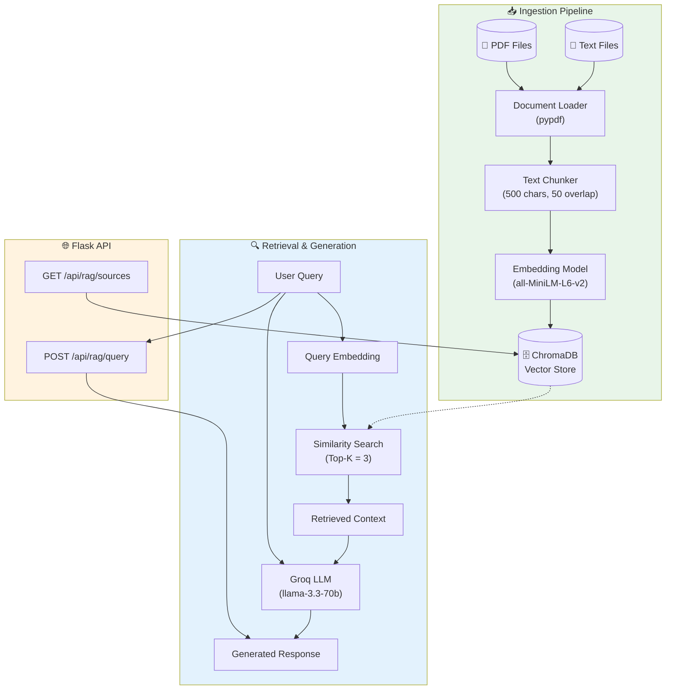
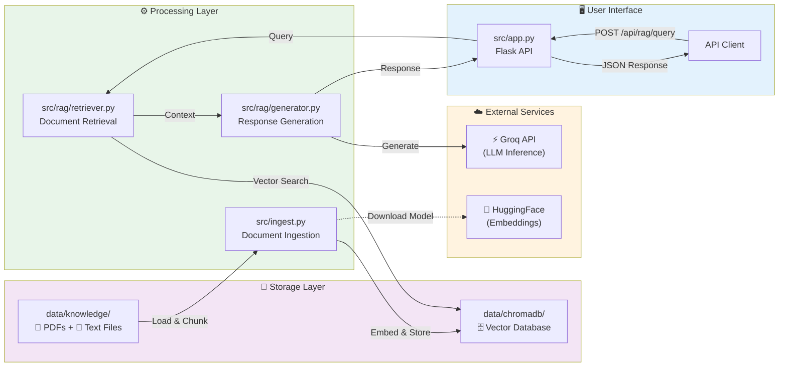

# RAG Pipeline Documentation

This document describes the Retrieval-Augmented Generation (RAG) pipeline for the AQI Prediction API.

## Overview

The RAG system allows users to ask natural language questions about air quality, health effects, and precautions. It retrieves relevant information from indexed documents and generates comprehensive answers using an LLM.

## System Architecture



## Data Flow Diagram



## Component Details

### 1. Ingestion Pipeline (`src/ingest.py`)

**Purpose:** Load documents, split into chunks, and store in vector database.

**Process:**
1. Scan `data/knowledge/` for PDF and text files
2. Extract text content from each file
3. Split text into overlapping chunks (500 chars, 50 overlap)
4. Generate embeddings using sentence-transformers
5. Store chunks with metadata in ChromaDB

**Usage:**
```bash
make rag-ingest
# or
python src/ingest.py
```

### 2. Document Retriever (`src/rag/retriever.py`)

**Purpose:** Query ChromaDB for relevant document chunks.

**Features:**
- Semantic similarity search
- Configurable top-K retrieval
- Returns text, metadata, and distance scores

### 3. Response Generator (`src/rag/generator.py`)

**Purpose:** Generate natural language responses using retrieved context.

**Features:**
- Formats context from multiple sources
- Uses Groq LLM (llama-3.3-70b-versatile)
- Returns structured JSON with answer, sources, and confidence

### 4. Flask API (`src/app.py`)

**RAG Endpoints:**

| Endpoint | Method | Description |
|----------|--------|-------------|
| `/api/rag/query` | POST | Ask questions about air quality |
| `/api/rag/sources` | GET | List indexed document sources |

**Example Request:**
```bash
curl -X POST http://localhost:8000/api/rag/query \
  -H "Content-Type: application/json" \
  -d '{"query": "What precautions should I take when AQI is 150?"}'
```

**Example Response:**
```json
{
  "success": true,
  "query": "What precautions should I take when AQI is 150?",
  "answer": "When AQI is 150 (Unhealthy for Sensitive Groups), you should...",
  "sources_used": ["health_precautions.txt", "aqi_overview.txt"],
  "confidence": "high",
  "generated_at": "2024-12-05 10:30:00"
}
```

## Configuration

All RAG settings are in `src/rag/config.py`:

| Setting | Default | Description |
|---------|---------|-------------|
| `CHUNK_SIZE` | 500 | Characters per chunk |
| `CHUNK_OVERLAP` | 50 | Overlap between chunks |
| `EMBEDDING_MODEL` | all-MiniLM-L6-v2 | Sentence transformer model |
| `LLM_MODEL` | llama-3.3-70b-versatile | Groq LLM model |
| `TOP_K` | 3 | Number of chunks to retrieve |

## Running the Pipeline

### Full Pipeline (Ingest + Serve)
```bash
make rag
```

### Individual Steps
```bash
# Step 1: Ingest documents
make rag-ingest

# Step 2: Start API server
make rag-serve
```

### Clean Up
```bash
make rag-clean  # Remove ChromaDB data
```

## Adding New Documents

1. Add PDF or text files to `data/knowledge/`
2. Run `make rag-ingest` to re-index
3. Query the API to test

## Environment Variables

Required in `.env`:
```
OPENAI_API_KEY=your-groq-api-key-here
```

Note: We use `OPENAI_API_KEY` for Groq API compatibility with existing code.
